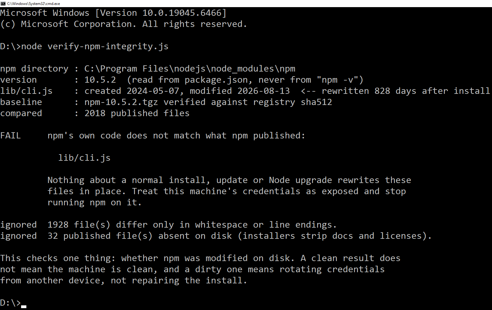

# verify-npm-integrity

Checks whether the npm installed on your machine still matches the files npm actually published.



*The npm bundled with Node 20.13.0, rewritten 828 days after it was installed.*

A class of infostealer persists by patching npm's own CLI in place, so every later `npm` command silently re-runs its payload. The patched file keeps its name and location, and `npm -v` keeps reporting the version you expect, because that version string is just text in a file the attacker now controls. Nothing looks wrong until something unrelated breaks.

This script never runs npm. It reads npm's files directly, downloads the official tarball for the same version from the registry, verifies that download against the registry's own integrity hash, and compares the two trees file by file.

Zero dependencies, deliberately. On a machine whose npm you don't trust, `npm install` is not an available step.

## Check it by hand first

You do not need this script. On Linux or macOS the core check is two commands:

```sh
NPM_DIR=$(dirname "$(readlink -f "$(command -v node)")")/../lib/node_modules/npm
VERSION=$(node -p "require('$NPM_DIR/package.json').version")

curl -sL "https://registry.npmjs.org/npm/-/npm-$VERSION.tgz" | tar -xzO package/lib/cli.js | sha256sum
sha256sum "$NPM_DIR/lib/cli.js"
```

Two identical hashes means npm's entry point is the one npm published.

On Windows, comparing hashes directly will report a mismatch on a perfectly healthy install, because Node ships npm with CRLF line endings that don't match the tarball. Compare the normalized text instead:

```powershell
$npm = "C:\Program Files\nodejs\node_modules\npm"
$ver = (Get-Content "$npm\package.json" -Raw | ConvertFrom-Json).version

Invoke-WebRequest "https://registry.npmjs.org/npm/-/npm-$ver.tgz" -OutFile "$env:TEMP\npm.tgz"
tar -xzf "$env:TEMP\npm.tgz" -C $env:TEMP package/lib/cli.js

$a = [IO.File]::ReadAllText("$npm\lib\cli.js")              -replace "`r`n", "`n"
$b = [IO.File]::ReadAllText("$env:TEMP\package\lib\cli.js") -replace "`r`n", "`n"
if ($a -eq $b) { "match" } else { "DIFFERENT" }
```

That covers the single file most likely to be patched. The script exists because doing the same thing across all ~2,000 files, without drowning in false positives, is more than a two-line job.

## Usage

```
node verify-npm-integrity.js
```

By default it checks the npm sitting next to the `node` you ran it with.

```
node verify-npm-integrity.js --npm-dir "C:\Users\you\AppData\Roaming\nvm\v20.13.0\node_modules\npm"
node verify-npm-integrity.js --scan-nvm     # every nvm-managed Node version on the machine
node verify-npm-integrity.js --json
node verify-npm-integrity.js --verbose      # list the files it filtered out
```

Requires Node 14+ and network access to `registry.npmjs.org`. It reads files, makes two HTTPS requests, and writes nothing.

## Exit codes

| Code | Meaning |
| --- | --- |
| 0 | npm's own files match what was published |
| 1 | npm's own files (`lib/`, `bin/`, `index.js`) have been modified |
| 3 | only bundled dependencies differ, worth reviewing |
| 2 | the check could not be completed |

## About false positives

A naive byte-for-byte comparison is useless here, and the numbers are worse than you'd guess. Run one against a stock Windows install and it reports roughly 1,929 modified files out of 2,018. All but one are line endings. Two causes, both handled:

**Whitespace and line endings.** Node installers and distribution packagers reflow files. On Windows that accounts for 1,928 of the files above; on a Debian npm 10.9.7 it's 18 files, every one of them trailing whitespace. The script hashes each file twice, once raw and once with line endings and trailing whitespace normalized. If only the raw hashes differ, the file is reported as cosmetic and does not count as a finding. Injected code is never whitespace-only, so nothing is lost by ignoring these.

**Vendor patching of bundled dependencies.** Distributions backport security fixes into the packages npm bundles, which produces genuine content differences under `node_modules/`. Those are reported separately, under `REVIEW` rather than `FAIL`, with their own exit code. A difference in `lib/` or `bin/` is npm's own source and has no comparable innocent explanation.

Files present on disk but absent from the tarball, and vice versa, are counted but not treated as findings. Node installers routinely strip licenses, docs and man pages.

One case is reported as a finding rather than an error: a file inside npm that the operating system refuses to read. Antivirus withholding access to a file is itself a signal.

## What a `FAIL` means

npm's own source has been rewritten after installation. Nothing about a normal install, update or Node upgrade does that.

Assume the credentials reachable from this machine are exposed: npm auth tokens in `.npmrc`, GitHub PATs, SSH keys, anything in `.env` files, browser-stored passwords, cloud and database credentials. Rotate them from a different device, not from this one. Stop running npm here. Then decide how far to rebuild.

Repairing the install is the wrong first move. The patched CLI is the part you happened to find.

## What this does not do

It checks one thing. It will not tell you whether a project's `node_modules` contains a malicious package, whether anything was installed for persistence elsewhere, or whether the machine is clean in general. A clean result narrows the question; it does not close it.

It also runs on the machine it is inspecting, which is a structural limitation no tool in this position escapes. Treat it as a cheap first check, not an all-clear.

## Why it exists

A backend contract, posted on a freelancing platform. Node, TypeScript, NestJS, webhooks, Postgres, Redis. The description said twice that it was not a frontend role. The first step for shortlisted candidates was to review the existing frontend page and send back feedback by video or screenshot.

You cannot produce a screenshot by reading code. You have to start the dev server. That step had no purpose in hiring a backend developer, and exactly one purpose otherwise.

The repository contained a typosquatted Tailwind plugin whose entry point pulled in a minified file purely for its side effects. There was no postinstall script, so `--ignore-scripts` would not have helped; the payload ran when Tailwind loaded the plugin during the build. Reading `src/` would have shown nothing, because the malicious code was never in the application. It was in the build tooling.

It rewrote the global npm CLI to spawn a hidden, detached Node process and evaluate an obfuscated payload on every subsequent npm command. What eventually gave it away was a modification time 828 days after the file was created. That is the check this script automates, plus the one that actually proves it.

## License

MIT